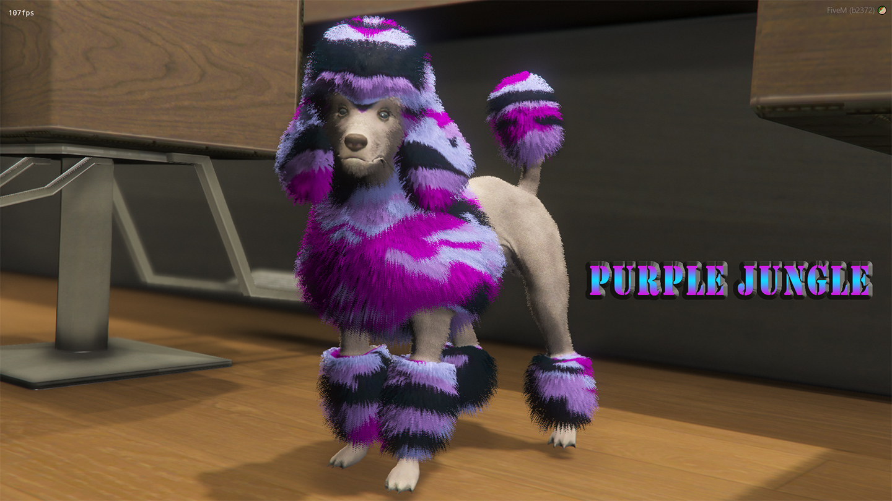
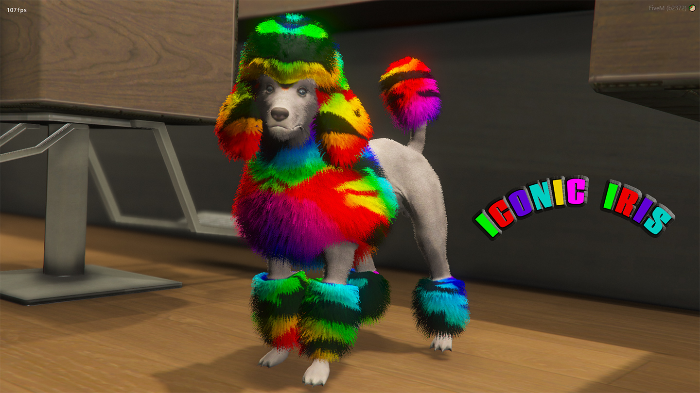

# Coloured Poodles for FiveM 🐩

You wouldn't be caught dead with a hat or purse that didn't match the colour of your aura, so why settle for less with any other accessory, like a poodle? Now available in a variety of colours, from the classic white to an unnaturally fashionable pink.

| | | |
|-|-|-|
|  |  |  |
|  |  |  |
|  |  |  |
|  |  |  |
|  |  |  |
|  |  |  |
|  |  |  |

_**Video Preview:**_

# Installing

1. Add to your resources folder.

2. Add `start Coloured-Poodles` to your server.cfg

# Regarding YMT files in FiveM

Coloured Poodles has a modified .ymt file which allows for the Poodle to have more than one texture, because of this, it is important to know that if you have any custom add-on clothing in your server, you may run into game crashes.

Depending on the GTA 5 game build/version you are running, the amount of add-on clothing packs you are able to strean, seems to be as following:

- b1604 (mpchristmas2018 'Arena Wars') Default FiveM Game Build - 14 ymt files.
- b2189 (mpheist4 'Cayo Perico) - 6 ymt files
- b2372 (mptuner 'Tuners DLC') - 4 ymt files.

Please take this into consideration before downloading and adding this to your server.

Enjoy =)
